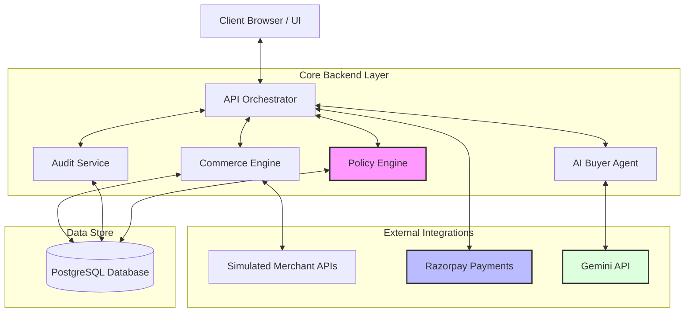
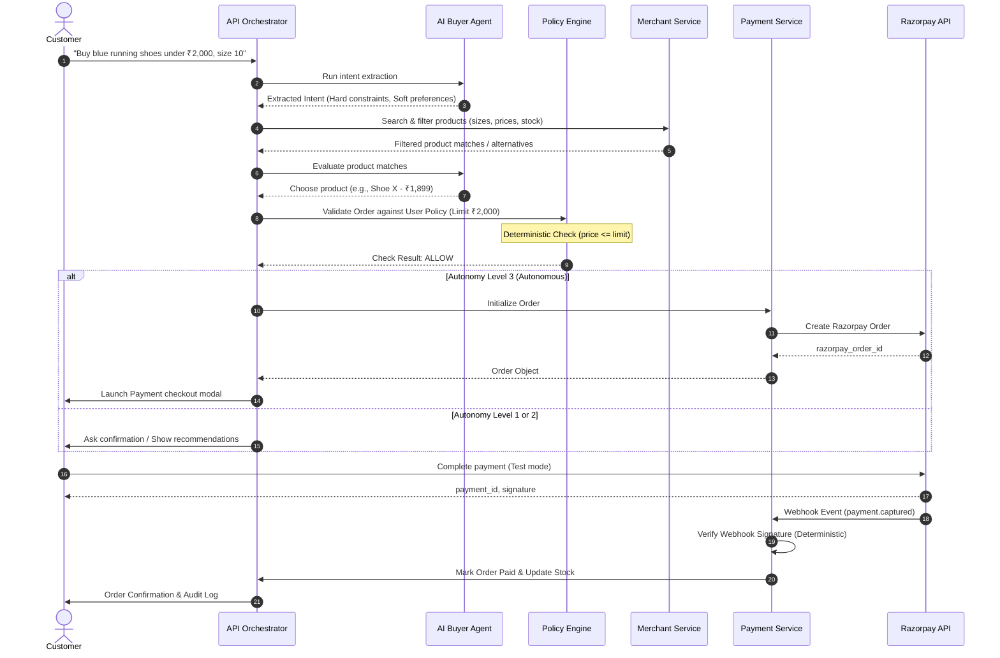

# AgentGuard System Architecture

This document describes the high-level architecture, component communication, data flows, and security guidelines for **AgentGuard**.

## 1. System Overview

AgentGuard is a modular monolith designed to enable secure, bounded-autonomy AI agentic commerce. The platform acts as an intermediary between a customer's natural-language desires and merchant inventories, using a deterministic Policy Engine and Razorpay for payment orchestration.



---

## 2. Core Components

### 2.1 AI Buyer Agent
- **Responsibility:** Extract user intent (category, size, budget, preferences, autonomy level) and plan actions.
- **Security Boundary:** Runs inside sandbox context. Cannot invoke database operations or payment execution. It can only call exposed commerce tools.

### 2.2 Constraint Engine
- **Responsibility:** Match product inventory against the user's intent.
- **Relaxation Logic:** Distinguish between Hard Constraints (absolute limits) and Soft Preferences. Identify matches and generate structured alternative recommendations when exact matches fail.

### 2.3 Policy Engine (Deterministic)
- **Responsibility:** A compile-time/runtime rule checker that validates orders before execution.
- **Security Rule:** Does NOT use LLMs. Written in standard code (TypeScript). Checks limits, categories, and signature verifications.
- **Output:** `ALLOW`, `BLOCK`, or `ASK_USER`.

### 2.4 Merchant Service
- **Responsibility:** Aggregate product catalogs and coordinate checkout/inventory operations for multiple simulated merchants.

### 2.5 Payment Service
- **Responsibility:** Coordinate order generation, status querying, and webhook signature verification using Razorpay.

### 2.6 Audit Service
- **Responsibility:** Write step-by-step reasoning logs and payment execution states to the `AuditLog` database table for customer transparency.

---

## 3. Core Autonomy Model

AgentGuard supports three explicit levels of buyer autonomy:

| Autonomy Level | Level Name | Purchase Action | Limit Checking |
| --- | --- | --- | --- |
| **Level 1** | Recommend | User selects & pays manually. | Recommended products only. |
| **Level 2** | Prepare | Agent adds items to cart. User clicks "Pay Now". | Budget verified by Policy Engine. |
| **Level 3** | Autonomous | Agent executes order & generates Razorpay Order automatically. | Enforced by Policy Engine bounds. |

---

## 4. Primary Transaction Flow

The transaction flow details how a request moves from user query to verified payment:



---

## 5. Security Rules

1. **No LLM Payment Initiation:** The LLM cannot direct the backend to execute a checkout. The backend orchestrator is the only coordinator that verifies constraints, checks policies, and calls Razorpay.
2. **Deterministic Webhook Verification:** Payment status updates are ONLY permitted through the verified webhooks (with signature checks) or direct Razorpay signature payloads.
3. **Budget Hard Bounds:** If a product exceeds the user's maximum budget by even ₹1, the transaction is hard-blocked at the Policy Engine stage.

---

## 6. Payment Integrity & Race Condition Safety

To prevent double inventory deductions or state race conditions from concurrent execution (e.g. signature verification API and webhooks arriving simultaneously), AgentGuard executes payment capturing and stock updates within an atomic database transaction with optimistic locking constraints:

1. **Transaction Isolation:** Inside `prisma.$transaction`, the order state is updated using `updateMany` filtering on order status:
   ```typescript
   const updated = await tx.order.updateMany({
     where: { id: orderId, status: "PENDING_PAYMENT" },
     data: { status: "PAYMENT_CAPTURED", ... }
   });
   ```
2. **Atomic Rollback:** If `updated.count === 0`, indicating a concurrent thread has already captured the payment, it throws an `ALREADY_PROCESSED` error to immediately abort the transaction.
3. **Exactly-Once Decrement:** Product stock levels are decremented *only* inside the transaction when the status update succeeds, preventing double-deductions.
